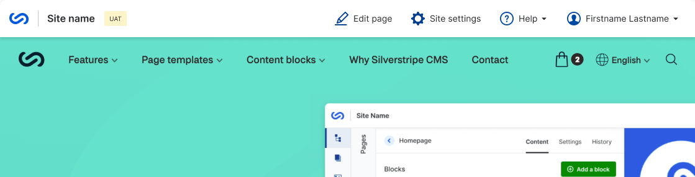

# Betamask Admin Overlay

Adds a feature-flagged utility bar with the theming of [betamask](https://github.com/silverstripeltd/betamask) to your front-end



## Requirements

* php >= 8.1
* SilverStripe ^5

## Installation

```sh
composer require silverstripeltd/betamask-bao
```

## How to use

After installing the module:

1. Go to `/admin/myprofile`
1. Navigate to the "Features" tab
1. Tick "On" under "Betamask (Frontend Bar)" and save

This will add the utility bar to the front-end for you - each user who wants to use the new look must enable it independently.
